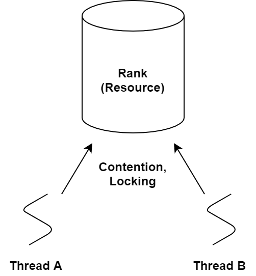
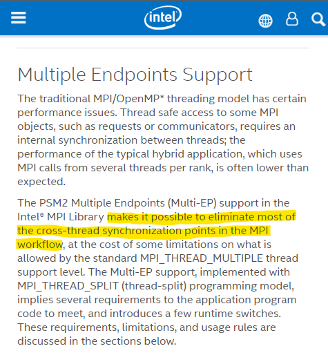

# Distributed Learning Anomaly
This repository is to record history about tracking distributed deep learning locality anomalies.
<br>

## Quick Link
[1-intel-mpi](#1-intel-mpi)

## NOTE
If docker run with priviledge and infiniband, the communication became slower.<br>
Why? Maybe because there is no proper infiniband driver installed.
<br>

# 1. What is Distributed Learning?
> Deep Neural Networks (DNNs) have dramatically improved the state-of-the-art for many problems<br>
> that machine learning (ML) and artificial intelligence (A.I.) community dealt with for decades,<br>
> including speech recognition, machine translaton, object identification, ...<br>
> <br>
> <cite>-- Salem Alqahtani, Murat Demirbas, “Performance Analysis and Comparison of Distributed Machine Learning Systems,” ICCCN, 2019.</cite>

This DNN, Deep Learning procedure is very hungry for large data.<br>
And of course, dealing with large data requires huge computing powers.<br>
Therefore, to derive larger computing powers to single DNN, Distributed Learning has arrived.
<br>

Distributed Learning is where multiple workers work together, and <br>
each worker run learning on chunks obtained by data parallelism, to obtain<br>
*local gradient*. These local gradients are gathered by sum or avgerage to produce<br>
*global gradient*.
<br>

# 2. Is it strictly epoch standard?
Log session hooks are called after `run`. But this `run` is not as same as `epoch`.<br>
Therefore, It cannot be explicitly said that even if `after_run` detects that epoch value>=10,<br>
It is not exactly epoch==10, but something like 10.02.
<br>

However, it looks like there is no need to worry about because between every run,<br>
Epoch is defined by global step, global batch size, and number of records,<br>
therefore, every epoch value `after_run` prints should be equal.<br>
However just in case, record start epoch value and start time,
and when epoch value is equal or bigger than the specific value,<br>
print differences in both epoch and time, and epoch difference divided by time difference.
<br>

# 3. Configure tensorflow not to save logs in /tmp
There is a suspicision that writing files of big size result in anomalies.
<br>

Even though `log_dir` is not set, the checkpoints are recorded while training.<br>
Inside the python script `/workspace/nvidia-examples/cnn/nvutils/runner.py`, within the `train` method,<br>
set `classifier`'s config related member variables to `None`.

Also, tensorflow uses a temporary model directory to write logs.<br>
This can be avoided by editing file:<br>
> /usr/local/lib/python3.6/dist-packages/tensorflow_estimator/python/estimator/estimator.py
<br>

At line number 1821, edit lines like this:
```python
  elif getattr(config, 'model_dir', None) is None:
    pass
    #model_dir = tempfile.mkdtemp()
    #logging.warning('Using temporary folder as model directory: %s', model_dir)
    #config = run_config.RunConfig.replace(config, model_dir=model_dir)
```
After this edit, I observed that temporary folder is not created inside `/tmp`.
However, will it really not write files by just letting the `model_dir` to be `None`?


# 4. Eliminate network part
`/usr/local/lib/python3.6/dist-packages/horovod/tensorflow/__init__.py`<br>
The above python script implements how ring-allreduce works.<br>
For example, see the line 311.
<br>

# 5. baidu-allreduce
Found a interesting repository on Github. The link is [here](https://github.com/baidu-research/baidu-allreduce).<br>
The repository is made by baidu, the company which implemented ring-allreduce algorithm.<br>
The repository is written in C++, and it demonstrates how the algorithm works in a brief.
<br>

I have run the code with two locality environments, 4-2-2, and 4-3-1.<br>
The three nodes are all in the same rack, so they share the same farthest network distance.<br>
Also, The node with the most processes has 4, which means they will have almost equal loads.
<br>

.png)
<br>

Since ring-allreduce is irrelvant to number of nodes or process distribution across
nodes, the result is quite astonishing.<br>
It was seen that the node with only one process is the source of the problem.<br>
The implementation of scatter-reduce (first phase out of two phases of ring-allreduce) is as follows:
<br>

```cpp
for (int i = 0; i < size - 1; i++) {
  int recv_chunk = (rank - i - 1 + size) % size;
  int send_chunk = (rank - i + size) % size;
  float* segment_send = &(output[segment_ends[send_chunk] -
                              segment_sizes[send_chunk]]);


  MPI_Irecv(buffer, segment_sizes[recv_chunk],
          datatype, recv_from, 0, MPI_COMM_WORLD, &recv_req);


  MPI_Send(segment_send, segment_sizes[send_chunk],
          MPI_FLOAT, send_to, 0, MPI_COMM_WORLD);

  float *segment_update = &(output[segment_ends[recv_chunk] -
                                    segment_sizes[recv_chunk]]);

  // Wait for recv to complete before reduction
  MPI_Wait(&recv_req, &recv_status);

  reduce(segment_update, buffer, segment_sizes[recv_chunk]);

}
```
<br>

It is a mere of demonstration of ring-allreduce,<br>
and does not know whether there are changes applied to horovod, implementation,<br>
but horovod mentioned they replaced the implementation with NCCL, and made several API improvements.<br>
Take a look at the section 4 Installing horovod, in this [report](https://arxiv.org/pdf/1802.05799.pdf) written by horovod team.<br>
Right now, I could not find any actual implemented code with MPI APIs inside horovod repository.
<br>

However, baidu also has a reporitory built with tensorflow and ring-allreduce.<br>
The ring-allreduce implementation is almost identical. I think I can make use of it.
<br>

The issue might come from that `send` and `recv` done by a thread are **not concurrent**.<br>
Without supporting hardwares, MPI non-blocking APIs do not receive nor send data background.<br>
It is like TCP protocol, where two processes must handshake to transport data.<br>
Same goes with MPI. MPI APIs need CPU's attention.<br>
Therefore, even if a process call `MPI_Irecv`and then `MPI_Send` and wait for the `MPI_Irecv`,<br>
it does each send and receive sequentially.
<br>

Even if it might be true for MPI, I do not know if same goes with other APIs, such as NCCL.<br>
I need to take a look at those other APIs.
<br>

# 6. How to Resolve
There are two resolutions came to mind:<br>
1. Implement asynchronous, background API.<br>
2. Run send and receive functions on separate threads.<br>
The former one is of course a lot more diffcult than the latter.
<br>

## Run send and receive functions on separate threads.
I can create two child threads, and have them do send or receive concurrently.<br>
Actually, there is no need of two child threads, what I mean is create<br>
one child thread and have it run send or receive, then the main thread<br>
can focus on doing the remaining one.
<br>

But the thing is whether child threads can call MPI APIs.<br>
Hopefully, MPI does support, but the document says that multiple thread support is
only lightly tested.<br>
Check out the [link](https://www.open-mpi.org/doc/v4.0/man3/MPI_Init_thread.3.php#toc9).
<br>

Also, `MPI_THREAD_MULTIPLE` support should have been configured.<br>
Run the command and see if the configured OPENMPI supports it:
```bash
ompi_info | grep -i thread
```
<br>

However this is not the possible solution. I was wrong.<br>
Internally, MPI does non blocking communications while doing blocking communications.
<br>

# 7. Why?
Here I list possible factors that might be the root of this anomaly.
<br>

## 1. NUMA
Since the environments are numa architecture, it could cause this kind of anomalies.<br>
To prevent this, we have to check that,<br>
By executing ``numactl --show``, the policy is ``default`` or ``bind``.<br>
``default`` is allocate from the same node first, and ``bind`` is allocate from the same node only.
<br>

Also, check processes distribution when starting mpi job.<br>
Check out ``--bind-to`` or ``--map-by``.

## 2. Rank Shared by Threads
This is the most feasible factor among candidates.<br>
There are so many papers which describes the speed limit caused by the ranks shared by threads.<br>
The rank is something like a resource, including network resource a shared object, and a locking unit<br>
to ensure the FIFO order of multiple MPI calls called by multiple threads.<br>
Thus, without independent contexts and ranks, the threads must propagate with mutual exclusion.
<br>



The solution for the problem proposed is creating endpoints, which is a sort of a rank.<br>
By assigning a endpoint to each thread, the threads can propagate without mutual exclusion.
<br>

However, even if the first propsal was made as MPI 3 standard, in 2015,<br>
it is not yet standardized until now, march 2021.
<br>

Luckily, Intel MPI has mutliple endpoints support since 2019, with psm2 library.<br>
I have to look into it.
<br>


<br>

### 1. Intel MPI

To download and install Intel MPI, execute:
```bash
wget https://registrationcenter-download.intel.com/akdlm/irc_nas/17427/l_HPCKit_p_2021.1.0.2684_offline.sh
```
<br>

and then,
```bash
bash l_HPCKit_p_2021.1.0.2684_offline.sh
```
<br>

The MPI will be installed at `/opt/intel/oneapi/mpi/2021.1.1`.
But before move on, I need to set environment variables.
<br>

```bash
source /opt/intel/oneapi/setvars.sh
```
<br>

Also, I need to change library kind to `release_mt` because multiple endpoint support is only available with that library.
```bash
source /opt/intel/oneapi/mpi/2021.1.1/env/vars.sh -i_mpi_library_kind=release_mt
```
<br>

Change I_MPI_THREAD_SPLIT to activate multiple endpoints.
```bash
export I_MPI_THREAD_SPLIT=1
```
<br>

The default maximum number of determined by `the omp_get_max_threads()`.<br>
If that is too large, it might fail to run the MPI program.<br>
Override the default value with, and change the `2` to the number of threads per rank:
```bash
export I_MPI_THREAD_MAX=2
```
<br>

`mlx` provider does not support multi-EP feature. See [here](https://software.intel.com/content/www/us/en/develop/articles/intel-mpi-library-2019-over-libfabric.html).<br>
Use TCP instead. I don't still get it why PSM2 emits errors.
```bash
export I_MPI_OFI_PROVIDER=TCP
```
<br>
The Intel MPI compiler name for C++ is `mpiicpc`.<br>
And the mpirun is just `mpirun`.
<br>

For mpirun problems, seems like openmpi and Intel MPI conflict each other.<br>
Watch this [Intel MPI link](https://software.intel.com/content/www/us/en/develop/articles/improve-performance-and-stability-with-intel-mpi-library-on-infiniband.html).
<br>

If debugging output is needed, set this:
```bash
export I_MPI_DEBUG=5
```

Then run with the following command:
```bash
mpirun -n 6 -machine m42 -iface enp216s0 ./allreduce-test cpu
```
Rembember to specify network interface otherwise it will fail to connect to remote machines.
<br>

I would better enable the `priviledged` flag when `docker run`ning, to give infiniband awareness to the docker.
<br>

# 8. Horovod

In horovod, The actual MPI_Allreduce happens in 
```bash
horovod/horovod/common/ops/mpi_operations.cc
```
